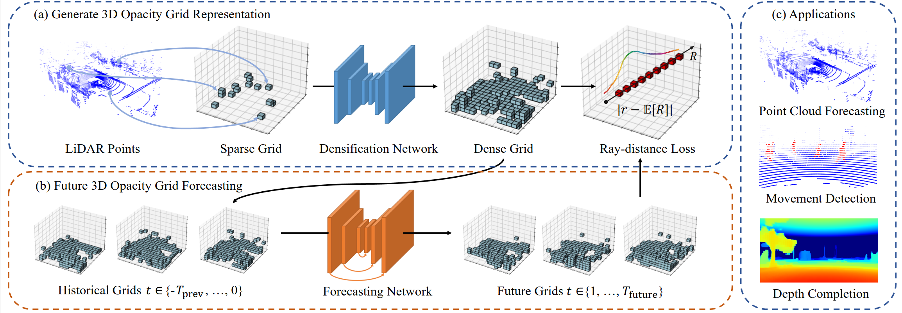

# LiDARGrid: Self-supervised 3D Opacity Grid from LiDAR for Scene Forecasting

<a href="https://pytorch.org/"></a> <a href="#"></a>
 

## Introduction

This is the official Pytorch implementation of **LIDARGrid**, proposed in the paper [LiDARGrid: 3D Opacity Grid from LiDAR for Scene Forecasting]()

We present LiDARGrid, a 3D opacity grid representation instantly derived from LiDAR points. Our method initiates a sparse grid with input LiDAR points, then it employs a novel volume densification procedure, which together with a differentiable optical model for volume rendering, generates a dense and continuous 3D opacity grid to represent the surrounding scene. Leveraging this representation, we perform scene forecasting and propose a 3D convolutional network backbone tailored to this task.

Our code implements the following two parts proposed in our paper:

1. *Volume Densification*, transforming a sparse grid to a continuous and dense grid through densification network. Both training and testing code resides in `./volume_densification` folder.
2. *Network Forecasting*, Predict future opacity grids by taking a sequence of historical grids and passing to a 3D convolutional forecasting network. Both training and testing code resides in `./scene_forecasting` folder.

Also, you could find the implementation of all the networks in `./model`, and NuScenes dataset related code in `./dataset`. We also provide a pretrained model for the densification network stored in `./pretrain`.

## Getting Started

**Clone the repo:**

```bash
git clone git@github.com:aolinxu/lidargrid.git
cd lidargrid
```

**Requirements**

- Python 3.7+ (numpy, Pillow, tqdm, matplotlib)
- Pytorch >= 1.7 (torch, torchvision)
- numpy
- matplotlib
- opencv-python
- nuscenes-devkit
- pyquaternion
- conda virtual environment is recommended, but optional

For evaluation, you need to install `chamferdist`:
```bash
pip install chamferdist
```
or install from the [source code](https://github.com/krrish94/chamferdist):
```bash
git clone git@github.com:krrish94/chamferdist.git
cd chamferdist
python setup.py install
```

**dataset**

- Please download [NuScenes](https://www.nuscenes.org/nuscenes#download) dataset. After downloading, you can replace `NUSC_ROOT` in `config.py` with the directory of the dataset.The dataset has the following structure:

  ```
  <nuscenes root>
  │
  └─── samples
  └─── sweeps    
  └─── v1.0-trainval
       └─── attribute.json
       └─── category.json
       └─── ...
  └─── v1.0-test
  └─── v1.0-mini
  └─── ...
  ```

  There are three versions of the dataset: trainval, test, and mini. We set them in `config.py` and you can always use different set of data in the code.

## Run Volume Densification

To train the volume densification network from scratch:

```bash
cd volume_densification
python train.py --outdir [path to output dir]
```

To test the volume densification network:

```bash
cd volume_densification
python test.py --checkpoint_path [path to densification model]
```

For example, you can set `[path to densification model]` as `../pretrain/densify.pth`

## Run Scene Forecasting

To train the scene forecasting network from scratch:

```bash
cd scene_forecasting
python train.py --outdir [path to output dir] --densify_pretrain [path to densification model] --horizon [number of input/output frames, e.g. 2]
```

To test the scene forecasting network:

```bash
cd scene_forecasting
python test.py --forecasting_pretrain [path to forecasting model] --densify_pretrain [path to densification model] --horizon [number of input/output frames, e.g. 2]
```

You can also set `--no_visualize` to disable visualization and make testing much faster.

## Citation

If you find our work useful to your research, please consider citing:

```latex
@article{lidargrid_corl2024,
  title={LiDARGrid: Self-supervised 3D Opacity Grid from LiDAR for Scene Forecasting},
  author={Pan, Chuanyu and Xu, Aolin},
  journal={The 8th Conference on Robot Learning},
  year={2024}
}
```
